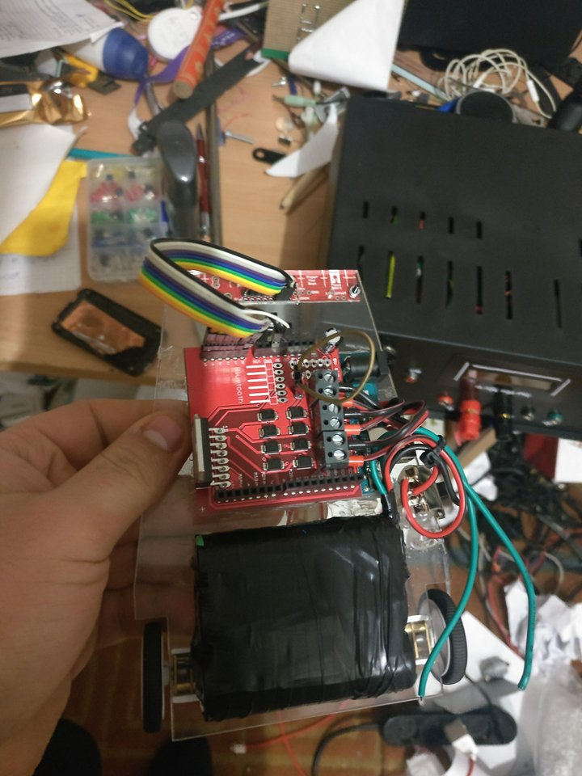

# Fast Line Follower Algorithm

 This is the implementation of an optimised PID for fast line follower.

 The implementation of the Integral Term in Classical PID controller was unsuitable for line tracking robot because of the problems when the curvature of the line changes. In order to solve this problem, only the last ten error values are summed up instead of adding all the previous values.This creates an integral control effort that strives to counteract steady state errors in curved paths, but is alsoadaptive to changes in curvature of the track. This technique provides satisfactory performance for line tracking. 
 
 For stability considerations, the maximum speed of the robot had to be set depending on the characteristics of thetrack on which the robot runs. This reduces the average speed of the robot because the speed needs to be reduced so that the robot is stable when negotiating sharp curves.In order to avoid this problem and to improve performance, the speed of the robot needs to be dynamically changed depending on curvature of the track. To achieve this, an additional parameter has been introduced which is henceforth called the speed reduction parameter. The speed reduction parameter is similar to the modified integral control parameter but it reduces the speed of both motors.
 
 
 
 My robot was based on an Arduino Uno board.To get the line position I used QTR-8A.The motors I used were Polulu 10:1 microcontrolers driven by L298N H-Bridge.
  
# References:

https://en.wikipedia.org/wiki/PID_controller

https://www.robotshop.com/letsmakerobots/pid-based-line-follower

https://www.researchgate.net/publication/283347335_Optimization_of_PID_Control_for_High_Speed_Line_Tracking_Robots
